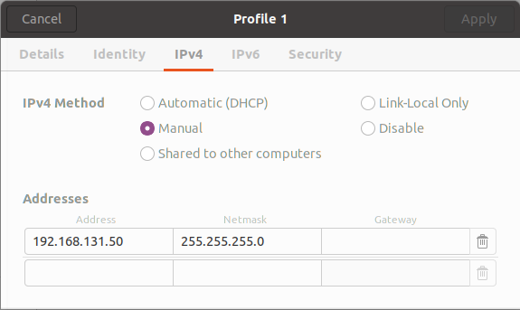

# Grizzly Setup

## Network configuration

### Step 1: Set up a network connection on your laptop

Go to settings (internet connectivity icon on toolbar) -> Edit Connections -> Add and change the IPV4 settings to the following



The important part is that the address is `192.168.131.XXX` where `XXX` is not already used on the Grizzly. For example, `192.168.131.1` is the address of the Grizzly computer, `192.168.131.2` is a motor driver etc so don’t use these. If you use an address that is already in use, the network error status light on the back of the Grizzly will come on as soon as you use the network and you won’t be able to drive.

### Step 2: Add the Grizzly computer to your /etc/hosts file

This allows your computer to match a hostname and IP address. Add the grizzly IP address and hostname to your /etc/hosts file. The first few lines of mine look like this:

```yaml
127.0.0.1  localhost
127.0.1.1  chris-ThinkPad-P50
192.168.131.1 cpr-cuddles
```

The last line is what you should add. If you don’t, you will get an error like “Couldn’t find an AF_INET address for [ cpr-cuddles]” when you try to launch a node on your laptop.

### Step 3: Set the correct environment variables in your [tmuxp file](./tmuxp)

The important variables are:

**ROS_MASTER_URI** is where the roscore is running (on the Grizzly)

```yaml
ROS_MASTER_URI: http://192.168.131.1:11311
```

**ROS_IP** is where your nodes will run (on your computer). This is the same IP as you set in your network configuration file in Step 1 above.

```yaml
ROS_IP: 192.168.131.200
```

**scenario_params** specifies the scenario file for your current experiment.

- **Important**: You will probably want to use a different value for this such as “2016_sudbury”  for your current experiment. Change appropriately.

```text
scenario_params:=2018_grizzly_chrism
```

Also note that you don’t launch a roscore since this is already running on the Grizzly.

That’s it! Now launch vtr2 by typing the following command in terminal from your asrl__navigation/tmuxp folder:

```bash
tmuxp load <tmuxp config>.yaml
```

## Start Grizzly

Start hardware

- Plug the laptop into power
- Plug ethernet and the usb for the xbox controller into the laptop
- Turn on the Grizzly
- Start a terminal

Start VT&R

- (Optional) Setup `byobu`, which is a wrapper on `tmux` that provide slive system status and some convenient keybindings. To learn more, start `byobu` in command line and press `F9`.
- Create a new tab in the terminal
- `roscd asrl__navigation`
- `cd tmuxp`
- `tmuxp load vtr2.yaml`
- Go to the grizzly tab
- Go to the bottom right window. Type in the Grizzly password twice.
- Go to the top window and type in the Grizzly password once.
- Go to the bottom left window. Type in the computer password twice. Turn on the xbox controller and move the joystick. You should see xbox messages being printed in the window as you move the joystick.

Release Grizzly stops and start commanding

- Check that all the e-stops (including the wireless one) are disengaged.
- Click the reset button on the back and left side of the Grizzly. If the blinking red light goes away and you here a soft click, then you are ready to drive.
- On the Xbox controller: Press `A` to be able to drive. As soon as you let go of this button the robot stops. Front right button (`R2`) is gas. Joystick is for turning.
