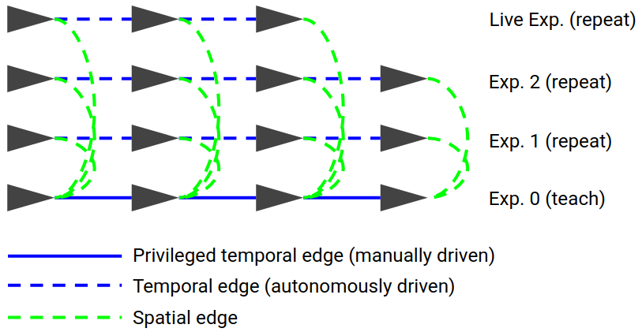
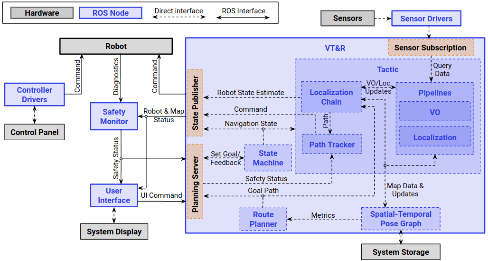
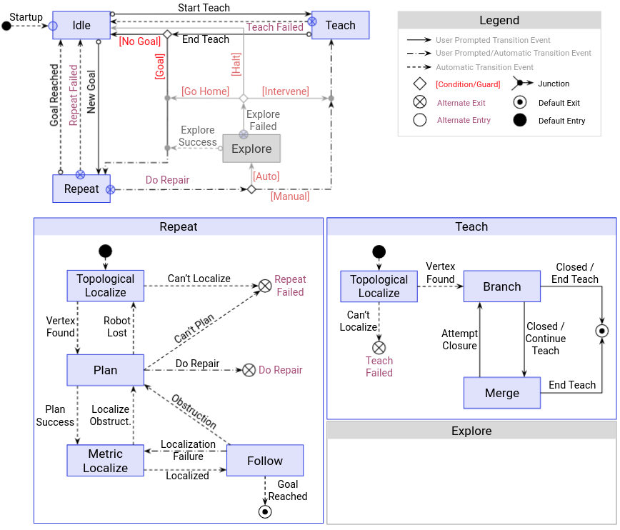
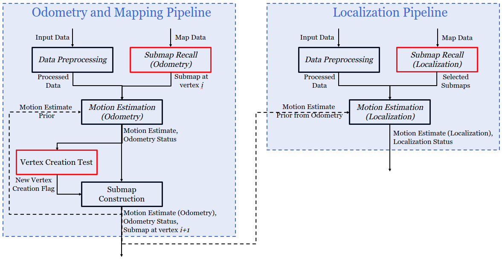
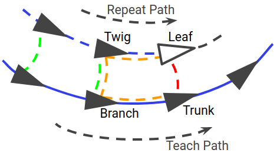

# (TODO: Yuchen, Mona, Jordy) Introduction to VT&amp;R3

VT&amp;R3 is a navigation system designed to enable **long-range** and and **long-term** autonomous route-following in unstructured, three-dimensional (3D) environment using on-board computation resources and sensors such as stereo-camera, LiDAR, RaDAR and/or GPS. As suggested by its name, VT&amp;R3 mainly involves two phases: the **teach** phase and the **repeat** phase.

- **Teach phase**: The robot is driven manually along the desired route, and the system builds up online a map of the environment. The map construction can be from scratch or on top of an existing map.
- **Repeat phase**: Given a target location on any of the previously taught route, the robot plans a route to this target location using any portion of the taught route and then drives autonomously along the planned route by localizing within its own map. A route can be followed immediately after teaching, no offline processing is required.

## Relative Navigation and Multi-Experience Localization

### Relative Navigation for **Long-Range** Autonomy

VT&amp;R3 follows a relative navigation framework through which it is unnecessary to either express the robot's pose in any global reference frame or build a globally consistent map of the environment. Relative navigation is achieved by representing the environment map via a relative pose graph, where each vertex defines a local frame with an attached metric map, and edges store transformations between adjacent frames. Robot pose estimation in VT&amp;R3 is performed with respect to the estimated closest local frames (see TODO for details). Relative navigation prevents unbounded error growth of purely relative motion estimation from odometry and is thereby the key to enable accurate long-range route following.

### Multi-Experience Localization for **Long-Term** Autonomy

Outdoor environments are subject to continuous structural and appearance changes, which typically causes challenge in map-based localization over long horizon in time. VT&amp;R3 addresses this problem by repeatedly mapping the environment during repeat phases in addition to the initial teach phase, storing all maps in a consistent manner using an extended pose graph structure named **Spatio-Temporal Pose Graph (STPG)**, and composing, online, a joint map from multiple traversal experiences of the environment for localization. Multi-Experience Localization in VT&amp;R3 allows intermidiate experiences from repeats to be used as a "bridge" between the live run and the priviledged experience from teach, and therefore, to a great extent, avoids localization failure over long-term.

#### Spatio-Temporal Pose Graph (STPG)

Spatio-Temporal Pose Graph extends the normal relative pose graph structure by having two types of edges, namely _spatial_ edges and _temporal_ edges. Temporal edges link vertices that are temporally adjacent and is created from odometry during both teach and repeat connecting the newly created vertex to the last one. In contrast, spatial edges link vertices that are temporally distant yet spatially close and is created from map-based localization during repeat between the newly created vertex and map-associating vertex.

To compose a multi-experience map, the associated local maps from a small selective window of connected vertices are transformed into the local reference frame of a single vertex (typically the current estimated closest vertex from teach phase) to form a larger joint map expressed in this local frame.

## System Architecture

Figure TODO shows the system architecture of VT&amp;R3 including its main components and information flow. VT&amp;R3 primarily relies on ROS2 to interface with sensors and robots and itself contains three ROS2 nodes:

- **VT&amp;R3 Navigation System**: receives sensor data and user commands from the VT&amp;R3 User Interface, and publishes feedbacks to the UI and desired control commands to the robot. The navigation system contains the following modules:
  - **State Machine**: gets user commands from the planning server and state updates from the route planner and state estimator and decides the current and desired state of the system and produces feedbacks that affect the subsequent system behavior.
  - **State Estimator**: utilizes a sensor specific, customizable data processing pipeline for odometry, mapping and localization; takes data from sensor(s), constructs a topo-metric map of the environment represented by a STPG. During the repeat phase, localizes robot's live view against the stored map, computes relative transformation between the robot and the route being followed and sends it to the path tracker.
  - **Route Planner**: given a user specified target location, plans a route on the network of taught routes in the form of a list of pose graph vertices and sends it to the state estimator and path tracker to initialize path following.
  - **Path Tracker**: given a planned route (as a list of pose graph vertices) and robot's localization update from the state estimator, outputs the desired control command for the robot to follow the the route closely.
  - **Spatio-Temporal Pose Graph**: holds the STPG data structure in memory and provides an interface to access local maps stored in vertices.
- **VT&amp;R3 User Interface**: provides an intuitive way of interacting with the VT&amp;R3 Navigation System via simple clicks instead of typing commands in a terminal.
- **VT&amp;R3 Safety Monitor**: serves as a control command filter that looks at several safety-related factors (e.g. localization status, dead man's switch, etc) and determines whether a control command from the navigation system should be passed to the robot.

## System States and Transition Events - the State Machine Module

The state machine in VT&amp;R3 adopts a two-level hierarchical design. The higher level comprises three states: **Idle**, **Teach** and **Repeat**. **Teach** and **Repeat** are considered meta-states within which lower level states are defined as listed below. State transitions are triggered by user commands or when certain conditions are met. Figure TODO provides a graphical summary of the system's states and transition events.

- **Idle**: start-up and default state where the robot sits still and VT&amp;R3 waits for user inputs.
- **Teach**: a meta-state where the robot is being taught a new route. Entering and exiting this meta-state happen immediately upon user's request.
  - **Metric Localize**: entry point of the teach meta-state, where the system tries to localize the robot against the local map of the estimated closest vertex. Upon successful localization, a new vertex is added and linked back to the localized vertex. The newly created vertex serves as a branching point off the existing network of routes, from which a new route is being taught. **Metric Localize** then terminates, and the system tansitions into **Branch**.
  - **Branch**: a state within which a new route is being taught on top of the existing network of routes. The robot is supposed to be driven manually, and the navigation system constructs a topo-metric map of the traversed environment for the first time. Termination of this state leads to either **Idle** or **Merge** depending on user input.
  - **Merge**: a state where the navigation system tries to perform a loop closure by localizing against one of the submaps from a list of candidate vertices specified by the user. When localization is succcessful and the result has been confirmed by the user, this state terminates and the system drops back to **Idle**.
- **Repeat**: a meta-state where the robot drives autonomously along the taught network of routes towards a goal location. Entering this meta-state happens upon user's request, while exiting this meta-state may be due to either user's request or destination reached.
  - **Plan**: entry point of the repeat meta-state, where the route planner receives the goal location and plans a route to it from robot's current location. Transitioning into **Metric Localize** is triggered when the route planner produces the route.
  - **Metric Localize**: similar to the **Metric Localize** under **Teach** except that the system transitions into **Follow** upon successful localization.
  - **Follow**: a state where the navigation system steers the robot to follow the planned route by localizing against its own map, while optionally constructing an additional topo-metric map of the traversed environment. Automatic transitioning to **Idle** happens when the robot reaches the end of the planned route.

## State Estimation in VT&amp;R3 - the State Estimator Module

As discussed above, the VT&amp;R3 state estimator module mainly constructs the topo-metric map of the environment and performs localization against the existing map to calculate path following errors. While construction of the topo-metric map is performed at all time during both **Teach** and **Repeat** (except during the **Plan** state), the specific map localization task depends on the lower-level state of the navigation system:

- **Metric Localize**: localizes against the local map of the robot's closest vertex set by the user.
- **Branch**: does not require any localization against exiting map.
- **Merge**: localizes against the local maps of a list of candidate vertices for loop closure specified by the user.
- **Follow**: localizes against the robot's estimated closest vertex, which the estimate comes from odometry and previous localization results, and sends this result to the path tracker.

### Data Processing Pipeline

The state estimator utilizes a sensor-specific, customizable data processing pipeline that implements the following functions:

- **preprocessing**: performs any data preprocessing tasks that do not require the map of the environment, such as image feature extraction, point cloud down-sampling, etc.
- **odometry** (incremental localization): estimates the robot's pose with respect to the local frame of the most recently created vertex in the pose graph.
- **mapping**: generates a metric map of the environment from one or multiple sensor views.
- **vertex creation**: determines whether a new vertex should be created, defines an associating local frame (usually the instant robot frame at which vertex is created), transforms the metric map to this frame and stores it into the vertex.
- **localization** (map-based localization): given a target vertex, estimates the robot's pose with respect to the local frame of this vertex using its associated local map.

These functions are called by the state estimator for topo-metric map contruction and computing path following errors. The inputs to these functions depend on the current system state.

TODO: LiDAR pipeline specification, Stereo-Camera pipeline specification

### Localization Chain

During path following at the repeat phase, the state estimator is given a sequence of vertices as the planned route and needs to 1. come up with a prior estimate of the live robot pose with respect to the current vertex for localization and 2. decide when to switch to the next vertex in sequence. To this end, the VT&amp;R3 state estimator uses a **Localization Chain** data structure to keep track of the important vertices in the pose graph and their respective transforms.

We use a ‘tree’ model to name vertices in the chain, going from the trunk vertex (defined as the closest vertex spatially on the privileged path), through the branch (the closest vertex on the privileged path with a successfully MLESAC estimated transform to the current path), twig (the corresponding vertex to the branch on the current path) and leaf (latest live vertex) vertices.

## Web-Based Graphical User Interface

## (TODO: Jordy) Path Tracker
